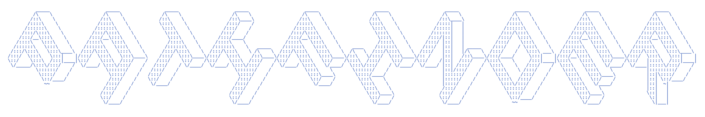

Multi-model orchestration for [Claude Code](https://code.claude.com): the frontier model plans and reviews in the main session; cheaper roles do volume work; quality is protected by fresh-context verification. Configuration only (agents, settings, policy, optional hooks). Not a runtime product.

Research and design rationale live under `docs/`. This repository is the pathfinder configuration layer itself.

## Why

Frontier sessions burn subscription limits fast. Most tokens in a coding session are search, mechanical edits, tests, and docs that cheaper models handle. Official guidance favors subagent delegation and independent fresh-context verifiers over self-critique. pathfinder packages that as a small global config.

## How it works

Three layers under `~/.claude/`:

| Layer | Location | Job |
|---|---|---|
| Machine | `settings.json` | Who orchestrates (`best`) + `fallbackModel` chain |
| Roles | `agents/*.md` | Seven roles with model/effort frontmatter |
| Policy | `CLAUDE.md` | How to delegate (role names only, never model names in prose) |

| Role | Model alias | Effort | Used for |
|---|---|---|---|
| `scout` | haiku | low | Read-only lookups |
| `Explore` | haiku | low | Overrides built-in Explore (pins cheap recon) |
| `mech-executor` | sonnet | low | Fully-specified mechanical work |
| `executor` | opus | medium | Implementation needing judgment |
| `light-verifier` | sonnet | low | Light check of mechanical work |
| `verifier` | opus | medium | Standard / heavy verification |
| `security-executor` | opus | high | Security-sensitive work (kept off frontier) |

### Verification tiers

| Level | Role | When |
|---|---|---|
| none | - | Trivial work the user skips |
| light | `light-verifier` | Mechanical `mech-executor` output |
| standard | `verifier` | Judgment / multi-file features |
| heavy | `verifier` (exhaustive) | Security, auth, secrets, crypto, financial |

The edit-tool denylist on verifiers reduces write surface; it does not prevent every possible write if Bash is available.

## Install

Minimum Claude Code: **v2.1.198**.

```text
Read install/AGENT-INSTALL.md from this pathfinder checkout
and follow it to install pathfinder into my global Claude Code configuration.
Show me the full plan of changes and get my approval before writing anything.
```

The approval gate is a convention the runbook asks agents to follow, not a technical enforcement boundary. Read the templates under `templates/` and prefer a tag or commit pin for network installs.

Idempotent upgrades: re-run install; see `CHANGELOG.md` via the update section of the runbook.

## Trust

- Trust flows from this repo and your review of installed bytes.
- Pin tag/SHA when fetching remotely so review matches install.
- Installer should show a plan and wait for approval (convention, not enforcement).

## Telemetry (optional)

Hooks may call `scripts/pathfinder-log.sh` on `SubagentStart`, `SubagentStop`, and `SessionEnd`. Output is JSONL under `~/.claude/pathfinder/logs/`.

This is **best-effort orchestration telemetry**. It is not an audit trail, not a complete session record, and not a full session history. Missed events are expected if hooks fail or are disabled. If hooks cannot be installed, use diagnostics only; pathfinder does not rely on the orchestrator remembering to log.

A separate optional `SessionStart` hook (`templates/hooks/pathfinder-version-watch.md`) injects a revalidation reminder at session start when Claude Code has updated, following the checklist in `docs/REVALIDATION.md`.

```bash
./scripts/pathfinder-diag.sh   # posix
./scripts/pathfinder-stats.sh  # empty logs are normal
```

## Project-local (optional)

Prefer native `.claude/` project settings and instructions for rules that must apply.

Optional: `.pathfinder/config.json` (see `examples/.pathfinder/config.json`) with `default_verification` and `logging`. Tools and docs may read it; the global install never merges project policy.

## Fallback

Policy prose never names models. Role frontmatter uses aliases (`opus`, `sonnet`, `haiku`). Main session prefers `best` (Fable 5 when available, else latest Opus). `fallbackModel: ["opus", "sonnet"]` covers overload/unavailability. Security work stays on `security-executor`.

## Platforms

- Config and agents: any Claude Code host meeting the minimum version.
- Shell helpers: POSIX only (macOS, Linux, WSL). Native Windows without POSIX shell: runbook file-tool path only.

## Docs

| Doc | Contents |
|---|---|
| [docs/research.md](./docs/research.md) | Sourced research |
| [docs/design.md](./docs/design.md) | Design rationale + pathfinder v1 appendix |
| [docs/usage-examples.md](./docs/usage-examples.md) | Short examples |
| [docs/improvement-roadmap.md](./docs/improvement-roadmap.md) | Deferred ideas only |
| [install/AGENT-INSTALL.md](./install/AGENT-INSTALL.md) | Install, update, uninstall, diagnostics |

## Uninstall

Tell Claude Code to follow the Uninstall section of `install/AGENT-INSTALL.md`. Logs under `~/.claude/pathfinder/logs` are left unless you ask to delete them.

## License

[MIT](./LICENSE)
